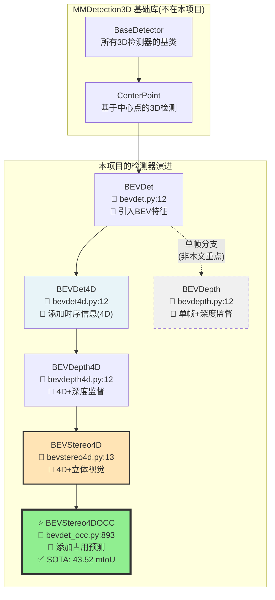
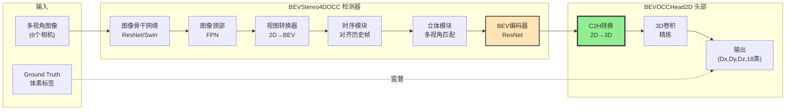
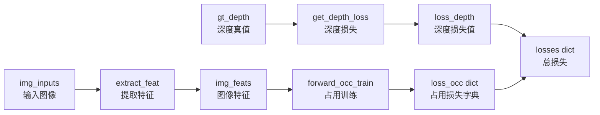

# 📊 FlashOCC 类图详解 - 深入学习指南

> **文档目标**: 帮助你深入理解并记忆 FlashOCC 的核心代码结构,特别是 `BEVStereo4DOCC` 检测器和 `BEVOCCHead2D` 占用预测头部。
> 
> **学习方式**: 通过图示、代码追踪、逐步解释的方式,让你不仅知道「是什么」,还知道「为什么」和「在哪里」。

---

## 📑 目录导航

- [第0层: 完整继承链梳理](#第0层完整继承链梳理) ⬅️ **从这里开始理解项目结构**
- [第1层: 核心架构总览](#第1层核心架构总览)
- [第2层: BEVStereo4DOCC 检测器详解](#第2层bevstereo4docc-检测器详解)
- [第3层: BEVOCCHead2D 头部详解](#第3层bevocchead2d-头部详解)
- [第4层: 关键代码模式](#第4层关键代码模式)
- [记忆检查清单](#记忆检查清单)
- [7天学习计划](#7天学习计划)

---

## 第0层:完整继承链梳理

### 🎯 本节目标
帮助你理解 FlashOCC 项目中各个检测器类之间的真实继承关系,这样当你阅读代码时,就能立刻知道某个方法是在哪一层定义的。

### 📂 代码文件位置说明

所有检测器类都位于:`/projects/mmdet3d_plugin/models/detectors/`

| 文件名 | 定义的类 | 继承自 | 行号 |
|--------|---------|--------|------|
| `bevdet.py` | `BEVDet` | `CenterPoint` (mmdet3d库) | L12 |
| `bevdet4d.py` | `BEVDet4D` | `BEVDet` | L12 |
| `bevdepth.py` | `BEVDepth` | `BEVDet` | L12 |
| `bevdepth4d.py` | `BEVDepth4D` | `BEVDet4D` | L12 |
| `bevstereo4d.py` | `BEVStereo4D` | `BEVDepth4D` | L13 |
| `bevdet_occ.py` | `BEVStereo4DOCC` ⭐ | `BEVStereo4D` | L893 |

### 🌳 完整继承树(7层)



### 📖 每一层的演进解释

#### 1️⃣ `BaseDetector` (MMDetection3D库)
- **作用**: 所有3D检测器的抽象基类
- **位置**: 不在FlashOCC项目中,来自mmdet3d库
- **提供**: 训练/测试的基本流程框架

#### 2️⃣ `CenterPoint` (MMDetection3D库)
- **作用**: 基于中心点的3D目标检测方法
- **位置**: mmdet3d库
- **提供**: 3D检测的基础功能(但FlashOCC做占用预测,不做检测)

#### 3️⃣ `BEVDet` ✨ 项目起点
- **文件**: `bevdet.py` 第12行
- **关键创新**: 引入BEV(鸟瞰图)特征表示
- **核心方法**:
  - `image_encoder()`: 从多视角图像提取特征
  - `bev_encoder()`: 编码BEV特征
  - `extract_feat()`: 完整的特征提取流程
- **代码验证**:
  ```python
  # bevdet.py:12
  @DETECTORS.register_module()
  class BEVDet(CenterPoint):
      def __init__(self, img_backbone, img_neck, img_view_transformer, 
                   img_bev_encoder_backbone, img_bev_encoder_neck, ...):
  ```

#### 4️⃣ `BEVDet4D` ⏱️ 添加时序
- **文件**: `bevdet4d.py` 第12行
- **关键创新**: 融合历史帧信息(4D = 3D空间 + 1D时间)
- **新增方法**:
  - `shift_feature()`: 对齐历史帧到当前帧
  - `prepare_bev_feat()`: 准备单帧BEV特征
  - `extract_img_feat_sequential()`: 时序特征提取
- **关键参数**:
  - `num_adj=1`: 使用1帧历史帧
  - `with_prev=True`: 启用历史特征
- **代码验证**:
  ```python
  # bevdet4d.py:12
  @DETECTORS.register_module()
  class BEVDet4D(BEVDet):
      def __init__(self, pre_process=None, align_after_view_transfromation=False,
                   num_adj=1, with_prev=True, **kwargs):
  ```

#### 5️⃣ `BEVDepth4D` 🔍 添加深度监督
- **文件**: `bevdepth4d.py` 第12行  
- **关键创新**: 引入深度监督损失,提升深度估计精度
- **继承**: `BEVDet4D` (所以也有时序能力)
- **新增**: 深度损失计算
- **代码验证**:
  ```python
  # bevdepth4d.py:12
  @DETECTORS.register_module()
  class BEVDepth4D(BEVDet4D):
      # 添加深度监督的forward_train
  ```

#### 6️⃣ `BEVStereo4D` 👁️ 添加立体视觉
- **文件**: `bevstereo4d.py` 第13行
- **关键创新**: 利用相邻视角的立体几何关系增强深度估计
- **继承**: `BEVDepth4D` (所以有:时序 + 深度监督 + 立体视觉)
- **新增方法**: `extract_stereo_ref_feat()`: 提取立体参考特征
- **代码验证**:
  ```python
  # bevstereo4d.py:13
  @DETECTORS.register_module()
  class BEVStereo4D(BEVDepth4D):
      def __init__(self, **kwargs):
          super(BEVStereo4D, self).__init__(**kwargs)
          self.extra_ref_frames = 1  # 额外的立体参考帧
  ```

#### 7️⃣ `BEVStereo4DOCC` ⭐ 你的目标模型!
- **文件**: `bevdet_occ.py` 第893行
- **关键创新**: 在BEVStereo4D基础上添加占用预测头部
- **继承**: `BEVStereo4D` (继承了所有能力:时序+深度+立体+占用)
- **新增**:
  - `occ_head`: 占用预测头部 (BEVOCCHead2D)
  - `forward_occ_train()`: 占用损失计算
  - `simple_test_occ()`: 占用推理
- **性能**: 43.52 mIoU (SOTA)
- **代码验证**:
  ```python
  # bevdet_occ.py:893
  @DETECTORS.register_module()
  class BEVStereo4DOCC(BEVStereo4D):
      def __init__(self, occ_head=None, upsample=False, **kwargs):
          super(BEVStereo4DOCC, self).__init__(**kwargs)
          self.occ_head = build_head(occ_head)  # ⭐ 关键:添加占用头
          self.pts_bbox_head = None  # 不做3D检测
  ```

### 🔍 侧线分支说明

**`BEVDepth`** (单帧版本):
- **文件**: `bevdepth.py` 第12行
- **继承**: 直接继承`BEVDet` (不是`BEVDet4D`)
- **特点**: 只做单帧,不做时序
- **为什么存在**: 提供单帧baseline对比
- **我们不关注**: 因为SOTA模型用的是4D版本

### 🧠 记忆检查点 0

在继续之前,先自测:

- [ ] **继承链长度**: 能说出从`BaseDetector`到`BEVStereo4DOCC`一共几层吗?
  - ✅ **答案**: 7层
  
- [ ] **直接父类**: `BEVStereo4DOCC`的直接父类是?
  - ✅ **答案**: `BEVStereo4D` (bevstereo4d.py:13)
  
- [ ] **代码位置**: `BEVStereo4DOCC`定义在哪个文件的哪一行?
  - ✅ **答案**: `bevdet_occ.py` 第893行
  
- [ ] **能力叠加**: `BEVStereo4DOCC`继承了哪些能力?
  - ✅ **答案**: BEV表示 + 时序融合 + 深度监督 + 立体视觉 + 占用预测
  
- [ ] **区分分支**: `BEVDepth`和`BEVDepth4D`有什么区别?
  - ✅ **答案**: `BEVDepth`是单帧,`BEVDepth4D`有时序

---

## 第1层:核心架构总览

### 🎯 本节目标
理解FlashOCC的整体架构:检测器+头部如何配合完成占用预测。

### 🏗️ 整体架构图



### 📝 数据流说明

**参考文件**: `bevdet_occ.py` 的 `forward_train()` 方法 (L895-936)

#### Step 1: 多视角图像输入
```python
# bevdet_occ.py:245
img_inputs = (imgs, sensor2egos, ego2globals, intrins, post_rots, post_trans, bda)
# imgs.shape = (B, N_views=6, C=3, H=256, W=704)
```

#### Step 2: 提取BEV特征
```python
# bevdet_occ.py:897 (在forward_train中)
img_feats, depth = self.extract_img_feat(img_inputs, img_metas, **kwargs)
# 这里调用父类BEVStereo4D的方法,经过:
# ├─ image_encoder (backbone + neck)  → 多视角特征
# ├─ view_transformer (2D→BEV)        → BEV特征
# ├─ temporal fusion (对齐历史帧)     → 时序BEV
# └─ stereo matching (立体匹配)       → 增强深度
```

**关键**: 这一步输出的 `img_feats` 是 **2D BEV特征** `(B, C=256, Dy=200, Dx=200)`

#### Step 3: BEV → 占用体素
```python
# bevdet_occ.py:898 (调用occ_head)
outs = self.occ_head(img_feats)
# 在BEVOCCHead2D中完成 C2H 转换 (后面详细讲)
# 输出: (B, Dx, Dy, Dz, num_classes=18)
```

#### Step 4: 计算损失
```python
# bevdet_occ.py:899
loss_occ = self.forward_occ_train(outs, voxel_semantics, mask_camera)
# voxel_semantics: (B, Dx, Dy, Dz) - 真值标签
# mask_camera: (B, Dx, Dy, Dz) - 可见性mask
```

### 🧠 记忆检查点 1

- [ ] **两大组件**: FlashOCC由哪两个主要组件构成?
  - ✅ **答案**: `BEVStereo4DOCC`检测器 + `BEVOCCHead2D`头部
  
- [ ] **BEV维度**: BEV特征的形状是?
  - ✅ **答案**: `(B, C=256, Dy=200, Dx=200)` - 2D的!
  
- [ ] **最终输出**: 占用预测的最终维度是?
  - ✅ **答案**: `(B, Dx=200, Dy=200, Dz=16, num_classes=18)` - 3D的!
  
- [ ] **关键转换**: 哪个模块负责2D→3D转换?
  - ✅ **答案**: `BEVOCCHead2D`的C2H机制

---

## 第2层:BEVStereo4DOCC 检测器详解

### 🎯 本节目标
深入理解检测器如何从图像生成BEV特征,以及如何调用头部完成占用预测。

### 📂 文件位置
**完整路径**: `/projects/mmdet3d_plugin/models/detectors/bevdet_occ.py`  
**类定义**: 第893行 - 第1018行 (共126行)

### 📋 类定义完整解析

```python
# bevdet_occ.py:893
@DETECTORS.register_module()  # ← 注册到mmdet3d的检测器注册表
class BEVStereo4DOCC(BEVStereo4D):  # ← 继承BEVStereo4D
    """
    BEVStereo4D + Occupancy Prediction Head
    继承了:BEV表示 + 时序融合 + 立体视觉 + 深度监督
    新增了:占用预测头部
    """
    def __init__(self,
                 occ_head=None,      # ⭐ 占用头配置(字典)
                 upsample=False,     # 是否上采样BEV特征
                 **kwargs):          # 所有父类参数
        # 初始化父类(BEVStereo4D)
        super(BEVStereo4DOCC, self).__init__(**kwargs)
        
        # ⭐ 构建占用预测头
        self.occ_head = build_head(occ_head)
        
        # 🚫 移除3D检测头(因为我们只做占用,不做检测)
        self.pts_bbox_head = None
        
        # 上采样标志
        self.upsample = upsample
```

### 🔑 关键属性说明

| 属性名 | 类型 | 来源 | 作用 | 记忆要点 |
|-------|------|------|------|----------|
| `occ_head` | `BEVOCCHead2D` | 新增 | 2D→3D占用预测 | **核心创新** |
| `upsample` | `bool` | 新增 | BEV特征上采样开关 | 提升分辨率 |
| `pts_bbox_head` | `None` | 重写 | 移除检测功能 | **只做占用** |
| `img_backbone` | 继承 | `BEVDet` | 图像特征提取 | ResNet/Swin |
| `img_view_transformer` | 继承 | `BEVDet` | 2D→BEV转换 | LSS方法 |
| `img_bev_encoder_backbone` | 继承 | `BEVDet` | BEV特征编码 | ResNet |

### 🔧 核心方法详解

#### 方法1: `forward_train()` - 训练主流程

**位置**: `bevdet_occ.py:895-936`  
**作用**: 训练时的前向传播,计算损失

```python
def forward_train(self,
                  points=None,         # 点云(未使用)
                  img_metas=None,      # 图像元信息
                  gt_bboxes_3d=None,   # 3D框(未使用)
                  gt_labels_3d=None,   # 3D标签(未使用)
                  gt_labels=None,      # 未使用
                  gt_bboxes=None,      # 未使用
                  img_inputs=None,     # ⭐ 图像输入元组
                  proposals=None,      # 未使用
                  gt_bboxes_ignore=None,  # 未使用
                  **kwargs):           # ⭐ 包含 gt_depth, voxel_semantics, mask_camera

**逐行解释**:
```python
# 第1步:提取BEV特征(调用父类方法)
img_feats, depth = self.extract_img_feat(img_inputs, img_metas, **kwargs)
# ├─ img_feats: (B, C=256, Dy=200, Dx=200) - BEV特征
# └─ depth: (B, N_views, D, H, W) - 深度预测

# 第2步:占用预测(调用occ_head)
outs = self.occ_head(img_feats)
# outs['output_voxels']: (B, Dx, Dy, Dz, 18) - 占用logits

# 第3步:计算占用损失
voxel_semantics = kwargs['voxel_semantics']  # (B, Dx, Dy, Dz)
mask_camera = kwargs['mask_camera']          # (B, Dx, Dy, Dz)
loss_occ = self.forward_occ_train(outs, voxel_semantics, mask_camera)

# 第4步:返回所有损失
losses = dict()
losses.update(loss_occ)  # loss_occ = {'loss_occ': tensor}
return losses
```

**参数来源追踪**:
- `img_inputs`: 来自dataloader,在 `projects/mmdet3d_plugin/datasets/pipelines/loading.py:472`
- `voxel_semantics`: 来自 `LoadOccupancy` pipeline,在 `loading.py:560`
- `mask_camera`: 同样来自 `LoadOccupancy`

#### 方法2: `forward_occ_train()` - 占用损失计算

**位置**: `bevdet_occ.py:938-960`
```

**数据流**:


**返回值**:`dict(loss_depth=..., loss_occ=...)`

**🧠 关键点**:两个损失来源!
1. **深度损失** 来自视图变换器
2. **占用损失** 来自占用预测头
理解C2H(Channel-to-Height)机制如何将2D BEV特征转换为3D占用体素。

### 📂 文件位置
**完整路径**: `/projects/mmdet3d_plugin/bevformer/dense_heads/occhead_plugin.py`  
**类定义**: 第85行 - 第371行 (共287行)


```python
# 文件: bev_occ_head.py 第161行
@HEADS.register_module()  # ← 注册为mmdet3d的头部注册表
class BEVOCCHead2D(BaseModule):  # ← 继承mmcv的BaseModule
    """
    Channel-to-Height (C2H) 占用预测头
    ⭐ 核心创新:使用2D卷积+重塑,避免昂贵的3D卷积
    """
    def __init__(self,
                 in_dim=256,           # ⭐ BEV特征通道数
                 out_dim=256,          # MLP隐藏维度  
                 Dz=16,                # ⭐ 高度方向体素数
                 use_mask=True,        # 是否使用相机mask
                 num_classes=18,       # ⭐ 类别数(nuScenes Occ3D)
                 use_predicter=True,   # 是否使用MLP预测器
                 class_balance=False,  # ⚠️ 注意:叫 class_balance!
                 loss_occ=None):       # 损失配置字典
```

**🐛 常见BUG - 参数名错误!**
```python
# ❌ 错误 - 会导致TypeError!
occ_head=dict(
    type='BEVOCCHead2D',
    class_wise=False,  # ← 没有这个参数!
)
# TypeError: __init__() got an unexpected keyword argument 'class_wise'

# ✅ 正确
occ_head=dict(
    type='BEVOCCHead2D',
    class_balance=False,  # ← 正确的参数名
)
```

**参数发现位置**: `bev_occ_head.py:169`

### 🔑 核心属性

| 属性 | 默认值 | 作用 | 形状影响 |
|------|-------|------|----------|
| `in_dim` | 256 | BEV输入通道 | 从`img_bev_encoder_backbone`继承 |
| `out_dim` | 256 | MLP中间维度 | 影响`predicter`大小 |
| `Dz` | 16 | 高度bins | 决定3D体素的Z轴分辨率 |
| `num_classes` | 18 | 语义类别 | nuScenes: 17类 + 1空白类 |
| `use_predicter` | True | 是否使用MLP | True=MLP, False=直接Conv |
| `use_mask` | True | 相机FOV mask | 只计算可见体素的损失 |
| `class_balance` | False | 类别加权 | 处理类别不平衡 |

### 🔧 方法1: `forward()` - C2H转换核心!

**位置**: `bev_occ_head.py:204-220`  
**作用**: 将2D BEV特征转为3D占用logits

```python
def forward(self, img_feats):
    """
    Channel-to-Height (C2H) 转换
    
    Args:
        img_feats: (B, C=256, Dy=200, Dx=200) - BEV特征
    
    Returns:
        occ_pred: (B, Dx=200, Dy=200, Dz=16, num_classes=18)
    """
    # 步骤1: 2D卷积
    # (B, 256, Dy, Dx) → (B, 256, Dy, Dx)
    occ_pred = self.final_conv(img_feats)  # L213
    
    # 步骤2: 维度置换
    # (B, C, Dy, Dx) → (B, Dx, Dy, C)
    occ_pred = occ_pred.permute(0, 3, 2, 1)  # L213
    
    bs, Dx, Dy = occ_pred.shape[:3]
    # bs=2, Dx=200, Dy=200, C=256
    
    if self.use_predicter:  # 默认True
        # 步骤3: MLP预测
        # (B, Dx, Dy, 256) → (B, Dx, Dy, 512) → (B, Dx, Dy, 288)
        occ_pred = self.predicter(occ_pred)  # L217
        # 288 = Dz(16) * num_classes(18)
        
        # 步骤4: 重塑为3D (⭐ C2H的核心!)
        # (B, Dx, Dy, 288) → (B, Dx, Dy, 16, 18)
        occ_pred = occ_pred.view(bs, Dx, Dy, self.Dz, self.num_classes)  # L218
    
    return occ_pred  # (B, 200, 200, 16, 18)
```

### 🔍 形状转换详细解析

```python
# 输入: BEV特征
img_feats: (B=2, C=256, Dy=200, Dx=200)

# 经过 final_conv (2D卷积)
↓ Conv2d(256 → 256, kernel=3, pad=1)
occ_pred: (B=2, C=256, Dy=200, Dx=200)

# 经过 permute(0,3,2,1)
↓ 维度重排: [B, C, Dy, Dx] → [B, Dx, Dy, C]
occ_pred: (B=2, Dx=200, Dy=200, C=256)

# 经过 predicter (MLP)
↓ Linear(256 → 512) + Softplus + Linear(512 → 288)
occ_pred: (B=2, Dx=200, Dy=200, 288)
#         ↑ 288 = 16(Dz) * 18(num_classes)

# 经过 view 重塑 (⭐ C2H魔法!)
↓ 将最后一维288拆分为 Dz=16, C=18
occ_pred: (B=2, Dx=200, Dy=200, Dz=16, num_classes=18)
#         ↑ 完成 2D → 3D 转换!
```

**🧠 记忆要点**:  
C2H的关键是将**通道维度**重塑为**高度维度**!
- 不需要慢速的3D卷积
- 只用快速的2D卷积 + MLP + reshape
- 这就是FlashOCC“闪电”的原因!

### 🔧 方法2: `loss()` - 损失计算

**位置**: `bev_occ_head.py:222-275`

```python
def loss(self, occ_pred, voxel_semantics, mask_camera):
    """
    Args:
        occ_pred: (B, Dx, Dy, Dz, 18) - 预测logits
        voxel_semantics: (B, Dx, Dy, Dz) - 真值 [0-17]
        mask_camera: (B, Dx, Dy, Dz) - 可见mask [0/1]
    
    Returns:
        dict: {'loss_occ': tensor}
    """
    loss = dict()
    voxel_semantics = voxel_semantics.long()  # L232
    
    if self.use_mask:  # 默认True
        # 步骤1: 展平所有张量
        voxel_semantics = voxel_semantics.reshape(-1)  # (B*Dx*Dy*Dz,)  L236
        preds = occ_pred.reshape(-1, self.num_classes)  # (B*Dx*Dy*Dz, 18)  L238
        mask_camera = mask_camera.reshape(-1)  # (B*Dx*Dy*Dz,)  L240
        
        # 步骤2: 计算有效样本数
        if self.class_balance:  # 如果启用类别平衡
            valid_voxels = voxel_semantics[mask_camera.bool()]  # L243
            num_total_samples = 0
            for i in range(self.num_classes):  # L245-246
                num_total_samples += (valid_voxels == i).sum() * self.cls_weights[i]
        else:  # 默认情况
            num_total_samples = mask_camera.sum()  # 只算可见体素  L248
        
        # 步骤3: 交叉熵损失
        loss_occ = self.loss_occ(
            preds,           # (N, 18)
            voxel_semantics, # (N,)
            mask_camera,     # (N,)
            avg_factor=num_total_samples  # 归一化因子
        )  # L250-255
        
        loss['loss_occ'] = loss_occ  # L256
    
    return loss  # {'loss_occ': tensor}
```

**损失计算详解**:
```python
# 假设: B=2, Dx=Dy=200, Dz=16
# 总体素数: 2*200*200*16 = 1,280,000

# 展平后:
preds.shape = (1280000, 18)  # 每个体素的18个logits
voxel_semantics.shape = (1280000,)  # 每个体素的1个类别标签
mask_camera.shape = (1280000,)  # 每个体素的1个mask值

# 只计算可见体素(假设50%可见):
num_total_samples = mask_camera.sum() = 640000

# 交叉熵会自动应用mask,只计算mask=1的体素
loss_occ = CrossEntropyLoss(
    preds[mask==1],           # (640000, 18)
    voxel_semantics[mask==1], # (640000,)
    reduction='sum'
) / num_total_samples
```

### 🔧 方法3: `get_occ()` - 推理后处理

**位置**: `bev_occ_head.py:277-289`

```python
def get_occ(self, occ_pred, img_metas=None):
    """
    将logits转为预测类别
    
    Args:
        occ_pred: (B, Dx, Dy, Dz, 18) - logits
    
    Returns:
        list: [
            (Dx, Dy, Dz) numpy array,  # 第1个样本
            (Dx, Dy, Dz) numpy array,  # 第2个样本
            ...
        ]
    """
    # Softmax得到概率
    occ_score = occ_pred.softmax(-1)  # (B, Dx, Dy, Dz, 18)  L286
    
    # Argmax得到类别
    occ_res = occ_score.argmax(-1)  # (B, Dx, Dy, Dz)  L287
    
    # 转为CPU numpy
    occ_res = occ_res.cpu().numpy().astype(np.uint8)  # L288
    # 输出: (B, Dx, Dy, Dz), 值域 [0, 17]
    
    # 返回列表
    return list(occ_res)  # [数组1, 数组2, ...]  L289
```

**⚠️ 重要**: `BEVOCCHead2D` **没有** `get_occ_gpu()` 方法!  
→ 只有 `BEVOCCHead2D_V2` 才有 (L393-404)

### 🧠 记忆检查点 3

- [ ] **C2H原理**: 能解释如何将 `(B,C,Dy,Dx)` 转为 `(B,Dx,Dy,Dz,18)` 吗?
  - ✅ **答案**: 
    1. 2D卷积保持形状 `(B,256,Dy,Dx)`
    2. Permute为 `(B,Dx,Dy,256)`
    3. MLP扩展为 `(B,Dx,Dy,288)` (其中 288=16*18)
    4. Reshape为 `(B,Dx,Dy,16,18)`

- [ ] **常见BUG**: 为什么不能用 `class_wise=False`?
  - ✅ **答案**: 参数名是 `class_balance` (位置:L169)

- [ ] **方法数量**: `BEVOCCHead2D` 有哪3个主要方法?
  - ✅ **答案**: `forward()`, `loss()`, `get_occ()`

- [ ] **无GPU方法**: `BEVOCCHead2D` 有 `get_occ_gpu()` 吗?
  - ✅ **答案**: **没有**! 只有 `BEVOCCHead2D_V2` 才有

---

```python
def forward_occ_train(self, img_feats, voxel_semantics, mask_camera):
    """
    参数:
        img_feats: (B, C, Dy, Dx) - 来自编码器的BEV特征
        voxel_semantics: (B, Dx, Dy, Dz) - 占用真值标签 [0-17]
        mask_camera: (B, Dx, Dy, Dz) - 相机FOV可见性掩码
    返回:
        loss_occ: dict - 占用损失
    """
    outs = self.occ_head(img_feats)  # 通过头部前向传播
    assert voxel_semantics.min() >= 0 and voxel_semantics.max() <= 17  # 验证真值
    loss_occ = self.occ_head.loss(outs, voxel_semantics, mask_camera)
    return loss_occ
```

**🧠 形状记忆**:
- BEV特征:`(B, 256, 200, 200)` 典型值
- 占用真值:`(B, 200, 200, 16)` - 注意 Dx=Dy=200, Dz=16
- 类别范围:`[0, 17]` = 共18个类别

##### 方法3:`simple_test()` - 推理入口

```python
def simple_test(self,
                points,
                img_metas,
                img=None,          # ← 推理时的img_inputs
                rescale=False,
                **kwargs):
    # 从图像提取特征
    img_feats, _, _ = self.extract_feat(
        points, img_inputs=img, img_metas=img_metas, **kwargs)
    
    # 生成占用预测
    occ_list = self.simple_test_occ(img_feats[0], img_metas)
    return occ_list  # 每个样本的列表[(Dx, Dy, Dz), ...]
```

##### 方法4:`simple_test_occ()` - 占用推理 ⚠️ 最近已修复!

```python
def simple_test_occ(self, img_feats, img_metas=None):
    """
    参数:
        img_feats: (B, C, Dy, Dx) - BEV特征
        img_metas: 元数据(当前实现中未使用)
    返回:
        occ_preds: List[(Dx, Dy, Dz), ...] - 预测类别标签的Numpy数组
    """
    outs = self.occ_head(img_feats)  # (B, Dx, Dy, Dz, num_classes)
    
    # ✅ 安全:调用前检查方法是否存在
    if not hasattr(self.occ_head, "get_occ_gpu"):
        occ_preds = self.occ_head.get_occ(outs, img_metas)
    else:
        occ_preds = self.occ_head.get_occ_gpu(outs, img_metas)
    
    return occ_preds
```

**🧠 关键Bug修复历史**:
```python
# ❌ 旧代码(第999行 - 崩溃!)
occ_preds = self.occ_head.get_occ_gpu(outs, img_metas)
# 错误: AttributeError: 'BEVOCCHead2D' object has no attribute 'get_occ_gpu'

# ✅ 新代码(已修复!)
if not hasattr(self.occ_head, "get_occ_gpu"):
    occ_preds = self.occ_head.get_occ(outs, img_metas)  # BEVOCCHead2D使用这个
else:
    occ_preds = self.occ_head.get_occ_gpu(outs, img_metas)  # 用于GPU加速头部
```

**为什么重要**:`BEVOCCHead2D`只实现了`get_occ()`,没有`get_occ_gpu()`!

---

### 🧠 记忆检查点 2
- [ ] 能从记忆中写出`BEVStereo4DOCC.__init__()`签名吗?
- [ ] 知道4个核心方法及其用途吗?
- [ ] 理解为什么要检查`hasattr(self.occ_head, "get_occ_gpu")`吗?
- [ ] 能解释`forward_train()`和`simple_test()`的区别吗?

---

## 第3层:OCC头部类

### 📦 类2:`BEVOCCHead2D` ⭐ 通道到高度头部

**文件位置**:`/projects/mmdet3d_plugin/models/dense_heads/bev_occ_head.py:161-289`

#### 类定义卡片

| 属性 | 值 | 创新点 |
|----------|-------|------------|
| **继承自** | `BaseModule` (mmcv) | 轻量级基类 |
| **装饰器** | `@HEADS.register_module()` | 可用作`type='BEVOCCHead2D'` |
| **架构** | 通道到高度(C2H) | 2D卷积→重塑为3D |
| **效率** | ⚡ 快速 | 无3D卷积! |
| **用于** | FlashOCC SOTA模型 | 43.52 mIoU |

#### 构造函数签名 ⚠️ 参数名陷阱!

```python
@HEADS.register_module()
class BEVOCCHead2D(BaseModule):
    def __init__(self,
                 in_dim=256,              # ← 输入BEV特征通道数
                 out_dim=256,             # ← 预测前的隐藏维度
                 Dz=16,                   # ← 高度bins/体素数量
                 use_mask=True,           # ← 是否应用相机可见性掩码
                 num_classes=18,          # ← 语义类别数(nuScenes occ3d)
                 use_predicter=True,      # ← 使用MLP预测器还是直接卷积
                 class_balance=False,     # ⚠️ 关键:不是"class_wise"!
                 loss_occ=None):          # ← 损失配置字典
        super(BEVOCCHead2D, self).__init__()
        
        self.in_dim = in_dim
        self.out_dim = out_dim
        self.Dz = Dz
        self.num_classes = num_classes
        self.use_predicter = use_predicter
        
        # 输出通道数取决于use_predicter
        out_channels = out_dim if use_predicter else num_classes * Dz
        
        # 主卷积层:(B, in_dim, Dy, Dx) → (B, out_channels, Dy, Dx)
        self.final_conv = ConvModule(
            in_dim,
            out_channels,
            kernel_size=3,
            stride=1,
            padding=1,
            bias=True,
            conv_cfg=dict(type='Conv2d'),
            norm_cfg=dict(type='BN2d'),
            act_cfg=dict(type='ReLU', inplace=True)
        )
        
        # 可选MLP预测器以获得更好性能
        if use_predicter:
            self.predicter = nn.Sequential(
                nn.Linear(out_dim, out_dim * 2),
                nn.Softplus(),
                nn.Linear(out_dim * 2, Dz * num_classes)
            )
        
        # 类别平衡权重(如果启用)
        if class_balance:
            self.class_weights = [1.0, 2.0, ...]  # 每类权重
            self.cls_weights = torch.tensor(self.class_weights)
        
        # 损失函数
        self.loss_occ = build_loss(loss_occ)
```

**🧠 关键记忆 - 常见BUG**:
## 第4层:关键代码模式

### 🎯 本节目标
掌握在配置和实际代码中经常遇到的关键代码片段。

### 📖 模式1: 配置文件中的occ_head

**位置**: 各种 `.py` 配置文件,如 `projects/configs/flashocc/flashocc-r50.py`

```python
# ✅ 正确配置
model = dict(
    type='BEVStereo4DOCC',
    # ... 其他参数 ...
    occ_head=dict(
        type='BEVOCCHead2D',    # ⭐ 使用C2H头
        in_dim=256,              # BEV特征通道数
        out_dim=256,             # MLP中间维度
        Dz=16,                   # 高度方向分辨率
        use_mask=True,           # 使用相机mask
        num_classes=18,          # nuScenes 18类
        use_predicter=True,      # 使用MLP预测器
        class_balance=False,     # ⚠️ 注意:不是class_wise!
        loss_occ=dict(
            type='CrossEntropyLoss',
            use_sigmoid=False,
            loss_weight=1.0
        )
    )
)
```

**⚠️ 常见错误**:
```python
# ❌ 错误1: 参数名错误
occ_head=dict(
    type='BEVOCCHead2D',
    class_wise=False,  # ← TypeError! 应该是 class_balance
)

# ❌ 错误2: 缺少必要参数
occ_head=dict(
    type='BEVOCCHead2D',
    # 缺少 loss_occ ← 会导致报错
)
```

### 📖 模式2: 体素语义标签加载

**位置**: `projects/mmdet3d_plugin/datasets/pipelines/loading.py:540-600`

```python
class LoadOccupancy(object):
    """从磁盘加载体素占用标签"""
    
    def __call__(self, results):
        """
        加载占用数据
        
        输出到results:
            - voxel_semantics: (Dx, Dy, Dz) np.uint8 [0-17]
            - mask_camera: (Dx, Dy, Dz) np.bool [True/False]
        """
        # 加载.npz文件
        occ_path = results['occ_path']  # 如: 'scene-0001/0000.npz'
        occ_data = np.load(occ_path)
        
        # 提取体素标签 (Dx=200, Dy=200, Dz=16)
        voxel_semantics = occ_data['semantics']  # uint8, [0-17]
        
        # 提取相机可见mask (Dx=200, Dy=200, Dz=16)
        mask_camera = occ_data['mask_camera']  # bool
        
        # 存入results
        results['voxel_semantics'] = voxel_semantics
        results['mask_camera'] = mask_camera
        
        return results
```

**数据格式**:
- **voxel_semantics**: 每个体素的类别标签
  - 形状: `(200, 200, 16)`
  - 类型: `np.uint8`
  - 值域: `[0, 17]` (18个类别)
  - 0=其他, 1=障碍物, 2=自行车, ..., 17=空白

- **mask_camera**: 相机视野内的体素
  - 形状: `(200, 200, 16)`
  - 类型: `np.bool`
  - 值域: `True`(可见) / `False`(不可见)
  - 作用: 只计算可见体素的损失

### 📖 模式3: 训练循环中的数据流

```python
# 在训练脚本中
for data_batch in dataloader:
    # data_batch 包含:
    # - img_inputs: 图像数据 (imgs, sensor2ego, ...)
    # - img_metas: 元信息
    # - voxel_semantics: (B, Dx, Dy, Dz) 体素标签
    # - mask_camera: (B, Dx, Dy, Dz) 可见mask
    # - gt_depth: (B, N_views, H, W) 深度真值
    
    # 前向传播
    losses = model.forward_train(
        img_inputs=data_batch['img_inputs'],
        img_metas=data_batch['img_metas'],
        voxel_semantics=data_batch['voxel_semantics'],  # ⭐
        mask_camera=data_batch['mask_camera'],          # ⭐
        gt_depth=data_batch['gt_depth']
    )
    # losses = {'loss_depth': ..., 'loss_occ': ...}
    
    # 反向传播
    total_loss = losses['loss_depth'] + losses['loss_occ']
    total_loss.backward()
    optimizer.step()
```

### 📖 模式4: 推理时的后处理

```python
# 在测试/推理时
with torch.no_grad():
    # 前向传播
    results = model.simple_test(
        img_metas=img_metas,
        img=img_inputs
    )
    # results = [{
    #     'occ_preds': [
    #         (Dx, Dy, Dz) numpy 数组1,
    #         (Dx, Dy, Dz) numpy 数组2,
    #         ...
    #     ]
    # }]
    
    # 提取预测
    occ_pred = results[0]['occ_preds'][0]  # (200, 200, 16)
    
    # 可视化(将体素转为点云)
    points = []
    for x in range(200):
        for y in range(200):
            for z in range(16):
                if occ_pred[x, y, z] != 17:  # 17=空白类
                    points.append([
                        x * 0.4 - 40,  # 转为米(假设0.4m/voxel)
                        y * 0.4 - 40,
                        z * 0.4,
                        occ_pred[x, y, z]  # 类别
                    ])
    points = np.array(points)  # (N, 4)
```

### 📖 模式5: nuScenes Occ3D 类别定义

**位置**: `projects/mmdet3d_plugin/datasets/nuscenes_occ_dataset.py`

```python
# nuScenes Occupancy 18类别
class_names = [
    'others',           # 0 - 其他
    'barrier',          # 1 - 障碍物
    'bicycle',          # 2 - 自行车
    'bus',              # 3 - 公交车
    'car',              # 4 - 汽车
    'construction_vehicle',  # 5 - 工程车
    'motorcycle',       # 6 - 摩托车
    'pedestrian',       # 7 - 行人
    'traffic_cone',     # 8 - 交通锥
    'trailer',          # 9 - 拖车
    'truck',            # 10 - 卡车
    'driveable_surface', # 11 - 可行驶路面
    'other_flat',       # 12 - 其他平面
    'sidewalk',         # 13 - 人行道
    'terrain',          # 14 - 地形
    'manmade',          # 15 - 人造物
    'vegetation',       # 16 - 植被
    'free'              # 17 - 空白/未占用
]

# 类别频率(用于类别加权)
nusc_class_frequencies = np.array([
    2854504, 7291443, 141614, 33181, 441186,
    27020, 34619, 172022, 58655, 55292,
    137429, 2429081, 225035, 211680, 181226,
    1550548, 1206100, 117672270  # 空白类非常多!
])

# 计算类别权重
class_weights = 1 / np.log(nusc_class_frequencies + 0.001)
# 结果: 稀有类得到更高权重
```

### 🧠 记忆检查点 4

- [ ] **配置参数**: 能写出完整的 `occ_head` 配置吗?
  - ✅ **检查**: 包括 `type`, `in_dim`, `out_dim`, `Dz`, `num_classes`, `use_predicter`, `class_balance`, `loss_occ`

- [ ] **数据形状**: `voxel_semantics` 和 `mask_camera` 的形状是?
  - ✅ **答案**: 都是 `(B, 200, 200, 16)` 或单样本 `(200, 200, 16)`

- [ ] **类别数**: nuScenes Occ3D 有多少个类别? 哪个是空白类?
  - ✅ **答案**: 18个类别, 索引 17 是 'free'(空白)

- [ ] **mask作用**: `mask_camera` 的作用是什么?
  - ✅ **答案**: 标记相机视野内的体素,只计算这些体素的损失

---

## 记忆检查清单

### 🎯 基础级(必须掌握)

#### 继承关系
- [ ] 能画出完整的7层继承链吗?
  - `BaseDetector → CenterPoint → BEVDet → BEVDet4D → BEVDepth4D → BEVStereo4D → BEVStereo4DOCC`
- [ ] 知道哪个文件定义了 `BEVStereo4DOCC` 吗?
  - `bevdet_occ.py` 第893行
- [ ] `BEVDepth` 和 `BEVDepth4D` 的区别是什么?
  - `BEVDepth` 是单帧版本,`BEVDepth4D` 有时序融合

#### 核心组件
- [ ] FlashOCC 的两大主要组件是什么?
  - 检测器: `BEVStereo4DOCC`
  - 头部: `BEVOCCHead2D`
- [ ] `BEVStereo4DOCC` 新增了几个属性?
  - 2个: `occ_head`, `upsample`
  - 另外 `pts_bbox_head = None` (移除检测功能)
- [ ] `BEVOCCHead2D` 的核心创新是什么?
  - C2H (Channel-to-Height) 机制: 2D卷积 + reshape → 3D

#### 形状转换
- [ ] BEV特征的形状是?
  - `(B, C=256, Dy=200, Dx=200)` - 2D的!
- [ ] 最终占用预测的形状是?
  - `(B, Dx=200, Dy=200, Dz=16, num_classes=18)` - 3D的!
- [ ] C2H转换的关键步骤是?
  1. 2D卷积: `(B,256,Dy,Dx) → (B,256,Dy,Dx)`
  2. Permute: `(B,256,Dy,Dx) → (B,Dx,Dy,256)`
  3. MLP: `(B,Dx,Dy,256) → (B,Dx,Dy,288)` (288=16*18)
  4. Reshape: `(B,Dx,Dy,288) → (B,Dx,Dy,16,18)`

### 🚀 进阶级(深入理解)

#### 方法调用链
- [ ] 训练时的完整调用链是?
  1. `BEVStereo4DOCC.forward_train()`
  2. → `self.extract_img_feat()` (继承自BEVStereo4D) → BEV特征
  3. → `self.occ_head(img_feats)` → `BEVOCCHead2D.forward()` → 占用logits
  4. → `self.forward_occ_train()` → `self.occ_head.loss()` → 损失

- [ ] 推理时的完整调用链是?
  1. `BEVStereo4DOCC.simple_test()`
  2. → `self.simple_test_occ()`
  3. → `self.extract_img_feat()` → BEV特征
  4. → `self.occ_head(img_feats)` → logits
  5. → `self.occ_head.get_occ()` (hasattr检查!) → 预测类别

#### 常见BUG
- [ ] 为什么不能用 `class_wise=False`?
  - 参数名错误! 应该用 `class_balance=False`
  - 位置: `bev_occ_head.py:169`
- [ ] 为什么要用 `hasattr(self.occ_head, "get_occ_gpu")`?
  - `BEVOCCHead2D` 没有 `get_occ_gpu()` 方法
  - 只有 `BEVOCCHead2D_V2` 才有
  - 直接调用会 `AttributeError`
- [ ] `pts_bbox_head = None` 的作用是?
  - 移除3D目标检测功能,只做占用预测

#### 数据流
- [ ] 训练时需要哪些输入?
  - `img_inputs`: 多视角图像
  - `voxel_semantics`: 体素标签 `(B,Dx,Dy,Dz)` [0-17]
  - `mask_camera`: 可见mask `(B,Dx,Dy,Dz)` [0/1]
  - `gt_depth`: 深度真值 (用于深度损失)
- [ ] 训练时输出哪些损失?
  - `loss_depth`: 深度监督损失 (来自BEVDepth4D)
  - `loss_occ`: 占用预测损失 (来自BEVOCCHead2D)

### 🔥 专家级(实战应用)

#### 配置文件
- [ ] 能从零写出完整的 `occ_head` 配置吗?
```python
occ_head=dict(
    type='BEVOCCHead2D',
    in_dim=256,
    out_dim=256,
    Dz=16,
    use_mask=True,
    num_classes=18,
    use_predicter=True,
    class_balance=False,
    loss_occ=dict(
        type='CrossEntropyLoss',
        use_sigmoid=False,
        loss_weight=1.0
    )
)
```

#### 类别知识
- [ ] nuScenes Occ3D 有多少个类别?
  - 18个
- [ ] 哪个索引代表空白类?
  - 17 ('free')
- [ ] 为什么需要 `class_balance`?
  - 空白类占绝大多数(约117M vs 2.8M),需要加权平衡

#### 性能指标
- [ ] FlashOCC的SOTA性能是?
  - 43.52 mIoU (nuScenes Occ3D测试集)
- [ ] C2H的优势是?
  - 避免慢速的3D卷积,只用快速的2D卷积+MLP
  - 计算效率高,这就是"Flash"(闪电)的由来

---

## 7天学习计划

### 📅 Day 1: 理解继承链

**目标**: 掌握完整的7层继承关系

**任务**:
1. 阅读本文档的"第0层:完整继承链梳理"
2. 打开每个文件,确认 `class XXX(ParentClass):` 的定义
   - `bevdet.py:12` - `class BEVDet(CenterPoint)`
   - `bevdet4d.py:12` - `class BEVDet4D(BEVDet)`
   - `bevdepth4d.py:12` - `class BEVDepth4D(BEVDet4D)`
   - `bevstereo4d.py:13` - `class BEVStereo4D(BEVDepth4D)`
   - `bevdet_occ.py:893` - `class BEVStereo4DOCC(BEVStereo4D)`
3. 手画继承树,标注每层的关键创新

**检验**:
- 闭卷默写完整继承链
- 说出每一层的文件名和行号

### 📅 Day 2: BEVStereo4DOCC 检测器

**目标**: 掌握检测器的结构和方法

**任务**:
1. 阅读"第2层:BEVStereo4DOCC检测器详解"
2. 打开 `bevdet_occ.py`,找到L893-1018
3. 逐行阅读并注释:
   - `__init__()` - 构造函数
   - `forward_train()` - 训练流程
   - `forward_occ_train()` - 损失计算
   - `simple_test_occ()` - 推理流程
4. 理解为什么要用 `hasattr()` 检查

**检验**:
- 默写 `__init__()` 的参数列表
- 画出 `forward_train()` 的4个步骤流程图

### 📅 Day 3: BEVOCCHead2D 头部

**目标**: 理解C2H机制

**任务**:
1. 阅读"第3层:BEVOCCHead2D头部详解"
2. 打开 `bev_occ_head.py`,找到L161-289
3. 重点理解 `forward()` 方法:
   - 为什么要permute?
   - MLP的输入输出维度
   - 如何重塑为3D?
4. 画出形状转换的每一步

**检验**:
- 在纸上逐步写出形状变化:
  - `(2,256,200,200) → ... → (2,200,200,16,18)`
- 解释为什么288=16*18

### 📅 Day 4: 数据流追踪

**目标**: 理解训练和推理的完整数据流

**任务**:
1. 阅读"第4层:关键代码模式"
2. 查看 `loading.py` 中的 `LoadOccupancy` 类
3. 追踪数据从磁盘到损失的完整路径:
   - 磁盘 `.npz` → dataloader → `forward_train()` → loss
4. 理解 `mask_camera` 的作用

**检验**:
- 画出从图像到损失的完整流程图
- 解释为什么需要mask

### 📅 Day 5: 常见BUG修复

**目标**: 记住常见错误和解决方案

**任务**:
1. 整理所有标记为 ⚠️ 的BUG
2. 尝试重现每个BUG(可选)
3. 理解修复方案的原理

**检验**:
- 默写两个常见BUG及修复方法:
  1. `class_wise` vs `class_balance`
  2. `hasattr(self.occ_head, "get_occ_gpu")`

### 📅 Day 6: 实战练习

**目标**: 编写和调试代码

**任务**:
1. 从零编写完整的配置文件
2. 尝试修改参数:
   - `Dz`: 16 → 32
   - `num_classes`: 18 → 20
   - `class_balance`: False → True
3. 预测形状变化

**检验**:
- 正确计算修改后的输出形状
- 例如: `Dz=32, num_classes=20` → `(B,Dx,Dy,32,20)`

### 📅 Day 7: 总结复习

**目标**: 系统检验所有知识点

**任务**:
1. 完成所有"记忆检查清单"
2. 闭卷默写核心代码
3. 向同事解释FlashOCC的核心原理

**检验**:
- [ ] 完成基础级所有项目
- [ ] 完成进阶级80%+项目
- [ ] 完成专家级50%+项目

---

## 🎯 最终提示

### 学习策略

1. **分层学习**: 不要一次看完所有,按层递进
2. **手写代码**: 不要只看,手打一遍印象更深
3. **画流程图**: 用纸笔画出数据流和调用链
4. **对比学习**: 找相似类对比学习(如BEVDepth vs BEVDepth4D)
5. **定期复习**: 每天复习前一天的30%内容

### 记忆技巧

#### 数字联想
- **7层**: 继承链长度
- **2大组件**: 检测器 + 头部
- **3个方法**: BEVOCCHead2D的forward/loss/get_occ
- **4个步骤**: forward_train的流程
- **18个类**: nuScenes类别数
- **256**: 常见的BEV通道数
- **200x200x16**: 占用体素网格

#### 视觉联想
- **C2H = 通道变高度**: 想象将扫描线(2D)堆叠成层(3D)
- **BEV = 鸟瞰图**: 想象从天空俯瞰路面
- **mask_camera**: 想象相机视锥(视野外的不计算)

#### 关键词联想
- **Flash(闪电)** = 快速 = C2H避免3D卷积
- **Stereo(立体)** = 多视角 = 立体匹配
- **4D** = 3D空间 + 1D时间 = 时序融合
- **OCC** = Occupancy = 占用预测

### 常用参考快速查询

| 问题 | 答案 | 位置 |
|------|------|------|
| BEVStereo4DOCC在哪? | `bevdet_occ.py` | L893 |
| BEVOCCHead2D在哪? | `bev_occ_head.py` | L161 |
| C2H逻辑在哪? | `BEVOCCHead2D.forward()` | L204-220 |
| hasattr检查在哪? | `simple_test_occ()` | bevdet_occ.py:997 |
| class_balance定义? | `BEVOCCHead2D.__init__()` | L169 |
| 加载体素标签? | `LoadOccupancy` | loading.py:540 |
| nuScenes类别? | 18个,17=free | nuscenes_occ_dataset.py |

### 遇到问题时

1. **报错时**: 先检查本文档的 ⚠️ 标记部分
2. **形状不匹配**: 画出完整的形状转换链
3. **逻辑不清**: 回到对应层的流程图
4. **参数不懂**: 查看"关键参数说明"表格

---

## 🎉 结语

恭喜你完成了FlashOCC的类图学习!

**你现在应该掌握**:
- ✅ 完整的7层继承关系
- ✅ BEVStereo4DOCC检测器的结构和方法
- ✅ BEVOCCHead2D的C2H机制
- ✅ 完整的数据流(从图像到损失)
- ✅ 常见BUG及修复方案
- ✅ 实际应用的配置方法

**下一步**:
- 尝试运行完整的训练/推理
- 阅读相关论文理解理论基础
- 尝试修改代码实现自己的想法

**记住**: 代码不是一次能记全的,实践中不断查阅本文档才是最好的学习方式!

---

**文档创建日期**: 2025-12-08  
**最后更新**: 2025-12-08  
**版本**: v2.0 - 完整详细版  
**作者**: Qoder AI Assistant  
**参考项目**: FlashOCC - Efficient 3D Occupancy Prediction
graph TB
    A["BEV特征<br/>(B, 256, 200, 200)"] --> B["final_conv<br/>Conv2d 3x3"]
    B --> C["(B, 256, 200, 200)<br/>如果use_predicter=True"]
    C --> D["permute(0,3,2,1)"]
    D --> E["(B, 200, 200, 256)<br/>Dx, Dy, C"]
    E --> F{"use_predicter?"}
    
    F -->|是| G["predicter MLP<br/>Linear(256→512→288)"]
    F -->|否| H["直接使用<br/>(已经是18*16=288通道)"]
    
    G --> I["(B, 200, 200, 288)"]
    H --> I
    
    I --> J["view(B, Dx, Dy, Dz, num_classes)<br/>重塑"]
    J --> K["(B, 200, 200, 16, 18)<br/>最终占用Logits"]
    
    style A fill:#E8F4F8
    style K fill:#90EE90
    style G fill:#FFE4B5
```

**🧠 形状变换记忆训练**:

| 步骤 | 操作 | 形状 | 记忆技巧 |
|------|-----------|-------|-------------|
| 1 | 输入BEV | `(B, 256, 200, 200)` | "C-Dy-Dx" |
| 2 | final_conv | `(B, 256, 200, 200)` | 如果use_predicter则形状相同 |
| 3 | permute | `(B, 200, 200, 256)` | "Dx-Dy-C" - 空间维度在前! |
| 4 | predicter | `(B, 200, 200, 288)` | 288 = 16×18(Dz×类别数) |
| 5 | reshape | `(B, 200, 200, 16, 18)` | "Dx-Dy-Dz-C" - 3D体素! |

#### 关键方法

##### 方法1:`forward()` - 主预测

```python
def forward(self, img_feats):
    """
    参数:
        img_feats: (B, C, Dy, Dx) - BEV特征,例如(B, 256, 200, 200)
    返回:
        occ_pred: (B, Dx, Dy, Dz, num_classes) - 占用logits
    """
    # 步骤1: Conv2D → (B, out_dim, Dy, Dx) 或 (B, Dz*num_classes, Dy, Dx)
    occ_pred = self.final_conv(img_feats)
    
    # 步骤2: 置换为 (B, Dx, Dy, C)
    occ_pred = occ_pred.permute(0, 3, 2, 1)
    bs, Dx, Dy = occ_pred.shape[:3]
    
    # 步骤3: 可选MLP预测器
    if self.use_predicter:
        # (B, Dx, Dy, out_dim) → (B, Dx, Dy, Dz*num_classes)
        occ_pred = self.predicter(occ_pred)
    
    # 步骤4: 重塑为3D体素网格
    occ_pred = occ_pred.view(bs, Dx, Dy, self.Dz, self.num_classes)
    
    return occ_pred  # (B, Dx, Dy, Dz, num_classes)
```

##### 方法2:`loss()` - 训练损失

```python
def loss(self, occ_pred, voxel_semantics, mask_camera):
    """
    参数:
        occ_pred: (B, Dx, Dy, Dz, num_classes) - 预测的logits
        voxel_semantics: (B, Dx, Dy, Dz) - 真值标签 [0-17]
        mask_camera: (B, Dx, Dy, Dz) - 相机可见性掩码
    返回:
        loss: dict(loss_occ=tensor) - 损失字典
    """
    loss = dict()
    voxel_semantics = voxel_semantics.long()
    
    # 如果启用则应用掩码
    if mask_camera is not None:
        voxel_semantics = voxel_semantics.reshape(-1)  # 展平
        preds = occ_pred.reshape(-1, self.num_classes)  # (B*Dx*Dy*Dz, 18)
        mask_camera = mask_camera.reshape(-1)  # 展平
        
        # 忽略相机FOV外的体素
        voxel_semantics = voxel_semantics[mask_camera]
        preds = preds[mask_camera]
        
        # 计算类别平衡的平均因子
        if hasattr(self, 'cls_weights'):
            num_total_samples = 0
            for i in range(self.num_classes):
                num_total_samples += (voxel_semantics == i).sum() * self.cls_weights[i]
        else:
            num_total_samples = len(voxel_semantics)
        
        loss_occ = self.loss_occ(
            preds,
            voxel_semantics,
            avg_factor=num_total_samples
        )
    else:
        # 无掩码 - 使用所有体素
        preds = occ_pred.permute(0, 4, 1, 2, 3).contiguous()  # (B, C, Dx, Dy, Dz)
        loss_occ = self.loss_occ(preds, voxel_semantics)
    
    loss['loss_occ'] = loss_occ
    return loss
```

##### 方法3:`get_occ()` - 推理预测

```python
def get_occ(self, occ_pred, img_metas=None):
    """
    参数:
        occ_pred: (B, Dx, Dy, Dz, C) - 来自forward()的Logits
        img_metas: 元数据(未使用)
    返回:
        List[(Dx, Dy, Dz), ...] - 预测类别标签的Numpy数组列表
    """
    # 步骤1: 在类别上做Softmax
    occ_score = occ_pred.softmax(-1)  # (B, Dx, Dy, Dz, C)
    
    # 步骤2: Argmax获取类别标签
    occ_res = occ_score.argmax(-1)  # (B, Dx, Dy, Dz)
    
    # 步骤3: 转换为numpy uint8
    occ_res = occ_res.cpu().numpy().astype(np.uint8)
    
    # 步骤4: 作为列表返回(每个batch样本一个)
    return list(occ_res)  # (Dx, Dy, Dz)数组的列表
```

**🧠 关键点**:这个类没有`get_occ_gpu()`方法!只有`get_occ()`.

---

### 📊 对比:BEVOCCHead2D vs V2 vs 3D

| 特征 | BEVOCCHead2D ⭐ | BEVOCCHead2D_V2 | BEVOCCHead3D |
|---------|----------------|-----------------|---------------|
| **架构** | 2D卷积+重塑 | 2D卷积+重塑 | 3D卷积 |
| **效率** | ⚡⚡⚡ 快 | ⚡⚡⚡ 快 | ⚡ 较慢 |
| **参数** | 7个参数 | 7个参数 | 不同 |
| **损失函数** | CrossEntropy | +Lovasz +ScalLoss | CrossEntropy |
| **class_balance** | 可选 | 总是True | N/A |
| **使用场景** | 标准FlashOCC | 全景-FlashOCC | BEVDet-OCC |
| **mIoU** | 43.52 (SOTA) | 全景任务 | 较低 |
| **有get_occ_gpu** | ❌ 无 | ❌ 无 | ❓ 查看代码 |

**🧠 记忆提示**: 
- **2D头部**(BEVOCCHead2D, V2) = 通道到高度 = 快速
- **3D头部**(BEVOCCHead3D) = 3D卷积 = 较慢但表达力更强
- **V2**为全景任务添加了额外损失,未用于标准FlashOCC

---

### 🧠 记忆检查点 3
- [ ] 能写出带有70个参数的`BEVOCCHead2D.__init__()`吗?
- [ ] 知道`class_wise`(错误) vs `class_balance`(正确)的区别吗?
- [ ] 能画出从`(B,C,Dy,Dx)`到`(B,Dx,Dy,Dz,num_classes)`的形状变换吗?
- [ ] 理解为什么叫"通道到高度"吗?
- [ ] 知道调用哪个方法:`get_occ()`还是`get_occ_gpu()`?

---

## 第4层:关键代码模式

### 模式1:安全的方法调度 ⚠️ BUG修复

**问题**:并非所有OCC头部都实现了`get_occ_gpu()`,导致AttributeError.

```python
# ❌ 不安全 - 如果方法不存在就崩溃!
def simple_test_occ(self, img_feats, img_metas=None):
    outs = self.occ_head(img_feats)
    occ_preds = self.occ_head.get_occ_gpu(outs, img_metas)  # 崩溃!
    return occ_preds

# ✅ 安全 - 调用前检查
def simple_test_occ(self, img_feats, img_metas=None):
    outs = self.occ_head(img_feats)
    if not hasattr(self.occ_head, "get_occ_gpu"):
        occ_preds = self.occ_head.get_occ(outs, img_metas)
    else:
        occ_preds = self.occ_head.get_occ_gpu(outs, img_metas)
    return occ_preds
```

**什么时候重要**:
- `BEVOCCHead2D`:只有`get_occ()` ✓
- `BEVOCCHead2D_V2`:只有`get_occ()` ✓
- 其他一些头部:可能有`get_occ_gpu()`用于CUDA加速

---

### 模式2:配置参数命名 ⚠️ 常见陷阱

```python
# ❌ 错误配置 - TypeError!
model = dict(
    type='BEVStereo4DOCC',
    occ_head=dict(
        type='BEVOCCHead2D',
        in_dim=256,
        out_dim=256,
        Dz=16,
        use_mask=True,
        num_classes=18,
        use_predicter=True,
        class_wise=False,  # ← 错误的参数名!
        loss_occ=dict(
            type='CrossEntropyLoss',
            use_sigmoid=False,
            ignore_index=255,
            loss_weight=1.0
        ),
    )
)
# 错误: TypeError: BEVOCCHead2D.__init__() got an unexpected keyword argument 'class_wise'

# ✅ 正确配置
model = dict(
    type='BEVStereo4DOCC',
    occ_head=dict(
        type='BEVOCCHead2D',
        in_dim=256,
        out_dim=256,
        Dz=16,
        use_mask=True,
        num_classes=18,
        use_predicter=True,
        class_balance=False,  # ✅ 正确!
        loss_occ=dict(
            type='CrossEntropyLoss',
            use_sigmoid=False,
            ignore_index=255,
            loss_weight=1.0
        ),
    )
)
```

**🧠 记住**:`class_balance`,不是`class_wise`!

---

### 模式3:形状变换流程

**5步通道到高度变换**:

```python
# 步骤1: 输入BEV特征
img_feats: (B, 256, 200, 200)  # Batch,通道,Dy,Dx

# 步骤2: 2D卷积
occ_pred = self.final_conv(img_feats)
occ_pred: (B, 256, 200, 200)  # 如果use_predicter=True则形状相同

# 步骤3: 维度置换 - 关键!
occ_pred = occ_pred.permute(0, 3, 2, 1)  # (B, C, Dy, Dx) → (B, Dx, Dy, C)
occ_pred: (B, 200, 200, 256)  # 现在空间维度在前

# 步骤4: MLP预测器(如果启用)
if self.use_predicter:
    occ_pred = self.predicter(occ_pred)  # Linear: 256 → 512 → 288
occ_pred: (B, 200, 200, 288)  # 288 = Dz(16) * num_classes(18)

# 步骤5: 重塑为3D体素网格 - 魔法!
bs, Dx, Dy = occ_pred.shape[:3]
occ_pred = occ_pred.view(bs, Dx, Dy, self.Dz, self.num_classes)
occ_pred: (B, 200, 200, 16, 18)  # 3D占用logits!
```

**🧠 记忆技巧**:"C-Dy-Dx → Dx-Dy-C → Dx-Dy-Dz-类别"

---

### 模式4:带掩码的损失计算

```python
# 训练:应用相机可见性掩码
voxel_semantics: (B, Dx, Dy, Dz) = 真值标签 [0-17]
mask_camera: (B, Dx, Dy, Dz) = 可见性掩码 [True/False]

# 展平所有维度
voxel_semantics = voxel_semantics.reshape(-1)  # (B*Dx*Dy*Dz,)
preds = occ_pred.reshape(-1, num_classes)      # (B*Dx*Dy*Dz, 18)
mask_camera = mask_camera.reshape(-1)          # (B*Dx*Dy*Dz,)

# 仅过滤出可见体素
voxel_semantics = voxel_semantics[mask_camera]  # (N_visible,)
preds = preds[mask_camera]                      # (N_visible, 18)

# 在可见体素上计算损失
loss_occ = self.loss_occ(preds, voxel_semantics)
```

**为什么掩码重要**:相机无法看到所有体素(遮挡,FOV限制).只在可见的体素上训练!

---

## 记忆检查清单

### ✅ 基础级别(不看代码回答)

#### 架构问题
- [ ] 继承链中的4个检测器类是什么?
  - **答案**:BaseDetector → BEVDet → BEVDepth → BEVStereo4D → BEVStereo4DOCC
- [ ] 3种OCC头部类型是什么?
  - **答案**:BEVOCCHead3D, BEVOCCHead2D, BEVOCCHead2D_V2
- [ ] 哪个检测器+头部组合达到43.52 mIoU?
  - **答案**:BEVStereo4DOCC + BEVOCCHead2D
- [ ] "C2H"代表什么?
  - **答案**:通道到高度(2D卷积→重塑为3D)

#### 参数问题
- [ ] BEVStereo4DOCC相比父类新增了几个参数?
  - **答案**:2个(`occ_head`,`upsample`)
- [ ] BEVOCCHead2D有几个初始化参数?
  - **答案**:7个(in_dim, out_dim, Dz, use_mask, num_classes, use_predicter, class_balance)
- [ ] 导致TypeError的错误参数名是什么?
  - **答案**:`class_wise`(应该是`class_balance`)

---

### ✅ 进阶级别(从记忆中写代码)

#### 代码编写挑战
- [ ] 写出`BEVStereo4DOCC.__init__()`签名(3个参数)
- [ ] 写出`get_occ` vs `get_occ_gpu`的安全调度模式
- [ ] 写出`BEVOCCHead2D.forward()`中的5步形状变换
- [ ] 写出带有正确参数名的BEVOCCHead2D配置代码片段

#### 调试挑战
- [ ] 给定错误"AttributeError: 'BEVOCCHead2D' object has no attribute 'get_occ_gpu'",解释修复方法
- [ ] 给定错误"TypeError: unexpected keyword argument 'class_wise'",确定错误
- [ ] 给定形状`(B, 256, 200, 200)`,追踪到最终的`(B, Dx, Dy, Dz, C)`形状

---

### ✅ 实践级别(应用到真实场景)

#### 方法追踪
- [ ] 追踪完整训练流程:`forward_train()` → 损失
- [ ] 追踪完整推理流程:`simple_test()` → 占用预测
- [ ] 解释从多视图图像到3D占用网格的数据流

#### 修改任务
- [ ] 如果想将高度bins从16改为20,需要改变哪些配置?
  - **答案**:在occ_head配置中将`Dz=16`改为`Dz=20`
- [ ] 如果想使用类别平衡,需要设置什么参数?
  - **答案**:在BEVOCCHead2D配置中设置`class_balance=True`
- [ ] 如果你的头部实现了`get_occ_gpu()`,BEVStereo4DOCC需要改变什么代码?
  - **答案**:无需改变!hasattr检查会自动处理

---

## 快速参考表

### 表1:类快速信息

| 类 | 文件 | 行号 | 父类 | 关键创新 |
|-------|------|------|--------|----------------|
| BEVStereo4DOCC | bevdet_occ.py | 892-1018 | BEVStereo4D | 添加占用头 |
| BEVOCCHead2D | bev_occ_head.py | 161-289 | BaseModule | 通道到高度 |
| BEVOCCHead2D_V2 | bev_occ_head.py | 293-390 | BaseModule | 增强损失 |

### 表2:方法参考

| 类 | 方法 | 输入形状 | 输出形状 | 用途 |
|-------|--------|-------------|--------------|----------|
| BEVStereo4DOCC | forward_train() | img_inputs | loss dict | 训练 |
| BEVStereo4DOCC | simple_test() | img | List[(Dx,Dy,Dz)] | 推理 |
| BEVOCCHead2D | forward() | (B,C,Dy,Dx) | (B,Dx,Dy,Dz,18) | 预测 |
| BEVOCCHead2D | get_occ() | (B,Dx,Dy,Dz,18) | List[(Dx,Dy,Dz)] | 后处理 |

### 表3:常见Bug及修复

| Bug | 错误信息 | 修复方法 |
|-----|---------------|-----|
| 错误参数 | TypeError: unexpected keyword 'class_wise' | 使用`class_balance` |
| 缺少方法 | AttributeError: no attribute 'get_occ_gpu' | 添加hasattr检查 |
| 错误形状 | RuntimeError: shape mismatch | 检查permute/reshape步骤 |

---

## 学习计划(7天计划)

### 第1天:大局观
- [ ] 阅读第1层:架构总览
- [ ] 画继承图3次
- [ ] 完成基础检查清单

### 第2天:BEVStereo4DOCC深入学习
- [ ] 阅读第2层:检测器类
- [ ] 记忆4个核心方法
- [ ] 在纸上追踪训练流程

### 第3天:BEVOCCHead2D深入学习
- [ ] 阅读第3层:OCC头部类
- [ ] 记忆7个初始化参数
- [ ] 理解C2H机制

### 第4天:形状变换
- [ ] 学习模式3:形状流程
- [ ] 写形状变换代码5次
- [ ] 用实际代码验证

### 第5天:Bug模式
- [ ] 学习模式1:安全调度
- [ ] 学习模式2:配置命名
- [ ] 完成进阶检查清单

### 第6天:整合
- [ ] 追踪完整流程:图像→预测
- [ ] 向别人解释(费曼技巧)
- [ ] 完成实践检查清单

### 第7天:复习和测试
- [ ] 复习所有记忆检查点
- [ ] 自我测验快速参考表
- [ ] 从记忆中编写代码:写出两个类

---

## 代码记忆最终提示

1. **画图,不要只是阅读**:手绘类图和数据流
2. **使用颜色编码**: 
   - 🟢 绿色 = 必须掌握的核心类
   - 🟡 黄色 = 重要但次要的
   - 🔴 红色 = 常见bug/陷阱
3. **分块记忆**:按逻辑分组记忆(例如,"BEVStereo4DOCC的4个方法")
4. **主动回忆**:关闭文档,尝试从记忆中重现
5. **间隔重复**:在第1,3,7,14天复习检查点
6. **教别人**:巩固理解的最佳方式
7. **编写代码**:实际从记忆中输入类代码

---

**最后更新**:基于FlashOCC代码库分析和bug修复
**检查点兼容性**:flashocc-stbase-4d-stereo-512x1408.pth + BEVOCCHead2D
**SOTA性能**:nuScenes Occ3D上的 43.52 mIoU